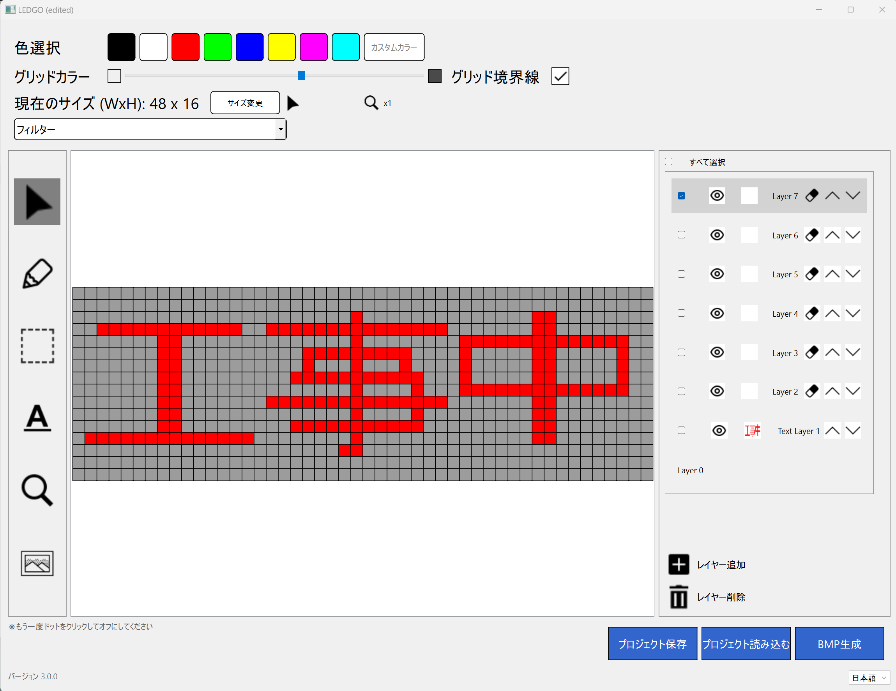

# LEDGO

This software is designed to enable anyone to design the display of LED array. 
The output is a bitmap file that can be converted into C++ array using [bitmap_converter](https://en.radzio.dxp.pl/bitmap_converter/). It's also ok if you just want to use LEDGO as a bitmap editor.



## Key features
- Layer management 
- Save/load project (including layout settings for later use)
- Unwanted text border-line removal
- Canvas size changing
- Supports Japanese (default) and English
- Full text editing

## Tutorial
Basic operations are provided as GIF in `/tutorials`.

## Installation
Install LEDGO via pip:
```
pip install -r requirements.txt
pip install pyinstaller #If you want to build .exe later 
```

## Compiling 
Build LEDGO using pyinstaller as follow:
```
pyinstaller --onedir --windowed --add-data "icons;icons" --add-data "stylesheet/stylesheet.css;stylesheet" ledgo.py
```
* After that, copy folder stylesheet, icons, font and file translate.json into dist folder

## Recommended settings
Please note that some parts of this software are under-experimental while others have been carefully tested. 
So far, we recommend the following choices:
- CPU: > core-i3
- RAM: > 8GB
- OS: Windows
- Targeted LED display < 400px x 400px
- Python: 3.11 (Anaconda framework if possible)

# Support
We are very interested in incorporating relevant and meaningful improvements and bug fixes. If you have such, please don't hesiate to contact us or make a pull request. However, due to lack of resources, we may or may not answer to trivial questions in Issues.

# LICENSE
This software is released under a dual license scheme. Users may use it under GPLv3(see LICENSE.md) or obtain a commercial license. 
Please contact contact[at]hachi-x.com (replace [at] with @) if you are interested in obtaining a commercial licence for distributing your derivative works without disclosing any source code.

# The team
LEDGO is currently maintained by [Trung Pham](https://github.com/Trungmaster5), [Hao Nguyen](https://github.com/duchaohachix), and [Duc LT](https://github.com/duclt1298) from HachiX Corporation. 
